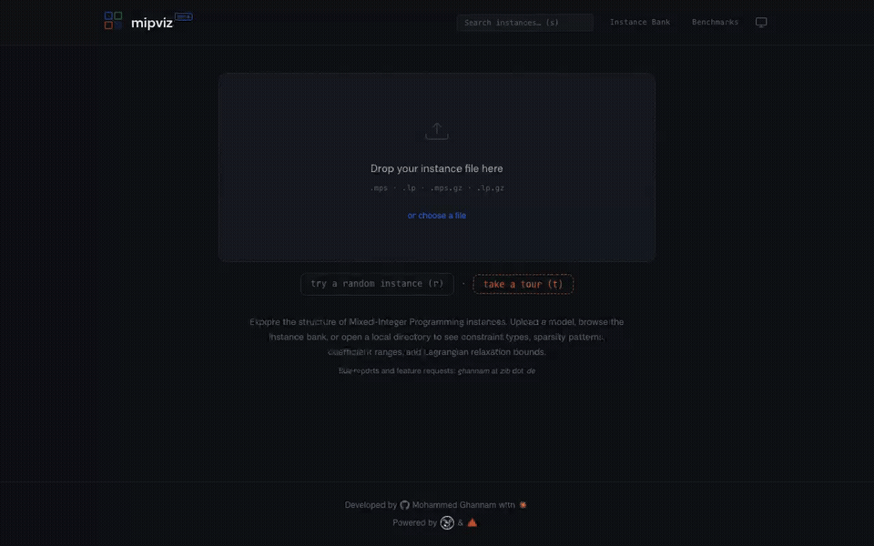

# mipviz

A web tool for exploring the structure of Mixed-Integer Programming (MIP) instances. Everything runs in the browser — SCIP and HiGHS are compiled to WebAssembly. Upload a model or browse the instance library to visualize constraint matrices, inspect presolve results, analyze symmetry, and compare solver performance.

**Live at [mipviz.mghannam.com](https://mipviz.mghannam.com)**



## Features

### Model Viewer
- **Upload & parse** MPS and LP files (including `.gz` compressed)
- **Instance bank** with 1000+ pre-loaded MIPLIB instances
- **Constraint & variable inspection** with LaTeX rendering
- **Coefficient range** analysis (objective, bounds, matrix, RHS)
- **Constraint type classification** across 12 categories

### Matrix Explorer
- **Interactive sparsity pattern** visualization with zoom and minimap
- **Presolve reduction stepping** to see how the matrix changes

### Presolve & Analysis
- **Presolve** via SCIP or HiGHS with original vs presolved comparison
- **Cliques & implications** extraction from presolve
- **Symmetry detection** showing generators, components, and group size (SCIP)
- **LP relaxation** and **MIP solving** with real-time log streaming
- **Lagrangian relaxation** bound plotting for individual constraints

### Conflict Graph
- **Variable conflict visualization** with clique discovery

### Solver Benchmarks
- **Performance comparison** across SCIP, HiGHS, COPT, and Optverse
- **Metrics**: solve time, nodes, presolve size, LP gap to best known solution
- **Per-instance detail pages** with root node bounds and solver logs
- Data from [Mittelmann MILP Benchmarks](https://plato.asu.edu/ftp/milp.html)

## Tech

- **Solvers**: [SCIP](https://www.scipopt.org) and [HiGHS](https://highs.dev), compiled to WebAssembly via Emscripten
- **MPS parsing**: [numnom](https://crates.io/crates/numnom) (pure Rust)
- **Frontend**: Vanilla JS, HTML, CSS — no framework


## Building

```bash
# Build the WASM module (requires Emscripten SDK)
cd wasm && ./build.sh

# Serve the static files
cd static && python3 -m http.server 3000
```

Then open [http://localhost:3000](http://localhost:3000).

## License

Apache 2.0
